# Story: Seasonal products

*Authors: Adrian Stępaniak (EkSoc UŁ), Piotr Grabysz (MIM UW), Piotr Kuczko (MIM UW)*

*Mentors: Adam Zmaczyński (Consultant), Karol Skorulski (Data Scientist)*

## Introduction

Our team's task was to find the most seasonal products among all sold products and predict their future sells.

This projects required answering this three important questions:

1. how to distinguish which product is more seasonal than the others?

2. what kind of seasonality should we analyze, e.g. change of sells during the year or week or maybe even the fluctuations of product's sales over the single day?  

3. are there any other useful data for prediction beside Shumee's retail dataset?

We answer question 1. and 2. in the section Most seasonal products and the question 3. in the section Model for predicting future sales.

It is important to note here that in the very early stage of the project we run into some difficulties and addressing them required a lot of data preprocessing. We keep the section Data preprocessing at the end of this article to not distract the reader from the main findings. But we would like to emphasis that data preparation was an important and a time consuming part of our work. 

## The most seasonal products

### Data representation

Before doing any further analysis, we grouped similar products as one cluster. It is described in greater details in the section Data preprocessing but here we give just some examples: 

group **zestaw wypoczynkowy** contains     
* Zestaw wypoczynkowy, 14 elementów, naturalny rattan
* Zestaw wypoczynkowy, 27 elementów, naturalny rattan  
* 6-cz. zestaw wypoczynkowy do ogrodu, poduszki, rat
* and many many more

group **stolik krzesła** contains:
* Stolik i krzesła barowe, 3 elementy, drewno',
* Stolik i krzesła barowe, 5 elementów, lite drewno akacjowe',
* Stolik i 2 krzesła z mozaiką niebiesko-białą',
* and many many more

### Seasonality measure
Now we would like to measure which of these groups exhibit the strongest seasonality in terms of number of sales. We use the seasonality measure which is described here [https://otexts.com/fpp2/seasonal-strength.html]. In this method the time series is decomposed into trend, seasonal component and remainder:

$$
y_t = T_t + S_t + R_t
$$

The strength of the seasonality is described as:

$$
F_S = max(0, 1 - \frac{Var(R_t)}{Var(S_T + R_t)}
$$

A rationale behinds this is that for strongly seasonal data the detrended time series should have much more variation than the remainder component has alone.

### What kind of seasonality?

Now it is time to answer the question of what period of times do we want to analyse. At first we thought about tracking the sales changes through the week, especially changes between working days and weekends. But let's plot the bar plot of mean number of sales for every weekday: 

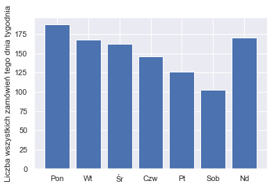

We were quite surprised by the fact that sales drop every day from Monday to Saturday. We were told by Shumee's representative that this is because some transaction have the delay between the payment and the confirmation from the bank. That is why some transactions actually made by customers on a weekend are not visible in Shumee's data until Monday. 

So we decided to not analyse the weekly seasonality, becuase the model based on this delayed data could drift far away from real customers behaviour. We think that the best solution is to consider monthly seasonality. Taking longer periods of time evens out the noise of delayed payments. On the other hand monthly seasonality is not so coarse as quaterly seasonality and could potentially capture more subtle patterns.

### The most seasonal products

The groups of products that gained the greatest $F_S$ measure are shown in the table:

|Name of products group | seasonality |
|-----------------------|-------------|
| strój świętego        | 0.881225 |
| szlafrok unisex       | 0.757613 |
| naciągany pokrowiec   | 0.740653 |
| siatka ogrodzeniowa   | 0.721494 |
| ostrzałka pił	        | 0.718631 |
| zestaw wypoczynkowy   | 0.718409 |
| stolik krzesła	    | 0.709425 |
| ogrodowy stół	        | 0.708391 |
| donica gabionowa	    | 0.701651 |
| ławka wokół	        | 0.700390 |

Let's see the sales of *strój świętego*:

```{r, out.width="700", fig.align="center", echo=FALSE}

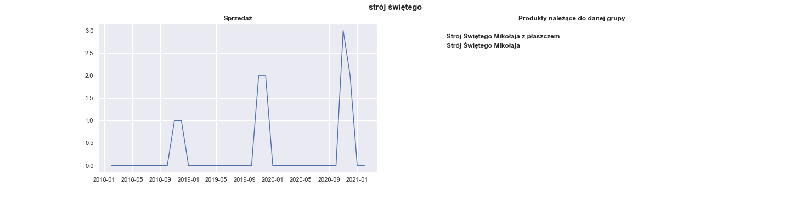
```

Whereas it has perfect seasonal pattern it was sold only 11 times during the whole period of Shumee's  existence. It is too little to train any model, so we should disregard groups that aren't sold up frequently enough.

Actually, we left only 100 best-selling groups, starting from *lampa* (4022 sales), *elastyczne pokrowce* (2680 sales), *dywan* (2674 sales) and ending  with *ścianki boczne* (204 sales). Among those 100 best-selling products the most seasonal are:

|Name of products group | seasonality |
|-----------------------|-------------|
|siatka ogrodzeniowa	| 0.721494 |
|zestaw wypoczynkowy	| 0.718409 |
|donica gabionowa	    | 0.701651 |
|zestaw mebli	        | 0.679052 | 
|parasol ogrodowy	    | 0.669685 | 
|kosz gabionowy	        | 0.658801 | 
|markiza	            | 0.612309 |
|klatka dla	            | 0.604560 |
|zaczepy do przyczepki	| 0.592115 |
|ławka ogrodowa	        | 0.586771 |

Their respective plots are:

```{r, out.width="700", fig.align="center", echo=FALSE}

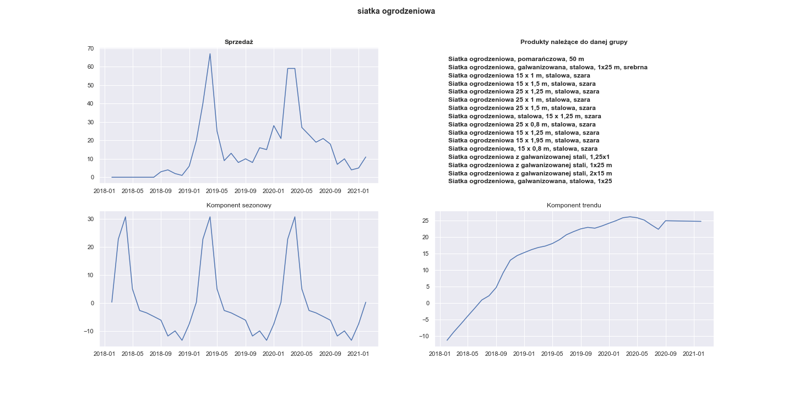
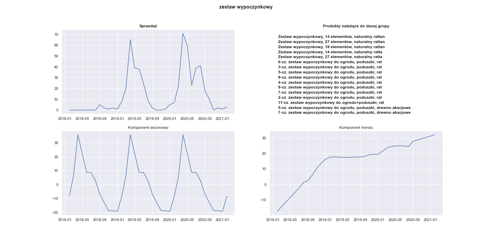
```


Visualization of the seasonal component of 20 most seasonal products:

```{r, out.width="700", fig.align="center", echo=FALSE}

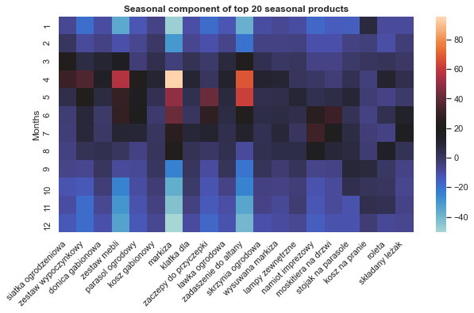
```

It can be seen that almost all of this products were sold the most often between March and August.

Now we choose some of this most seasonal products to train some models for future predictions.

## Model for predicting future sales

For sales predicting we use Prophet, a tool developed by engineers from Facebook for time series forecasting. While it is a very powerful model there are no ready-to-go XAI techniques. We describe some of our proposals later.

We wondered what additional information could be useful in forecasting. We came up with this ideas:

* Google trends - one can use Google trends to get the popularity of any given query made in google browser. We thought that this might be potentially useful. Our guess was that seeing increase in popularity of some products in Google one should expect increase in sales of these products.

* Temperature - mean temperature in Poland in a given month. Restricting our interest only to Poland's temperatures is valid since we only use products sold in Poland anyway. The reason behind using it is that the most seasonal products have the peak in their sales in spring and summer, as we could see in the previous section. They are frequently associated with outdoor activities. So can rising temperatures anticipate the boom in tents or garden chairs sales? 

* New cases of coronavirus - new cases of coronavirus in a given month in Poland. The pandemic undisputably affected a lot of different areas in our life. But it may be especially related to our shoping activites. Firstly, because large number of covid cases has been forcing stationary shops to be closed. It is clearly visible in Shumee data that their fast growth is even greater after March 2020. But secondly there is also a chance that the pandemic changed what people find valuable to buy and what they want to buy.

* Total number of all sells of all products in a given month.

First of all it is worth taking a look at the correlation between the seasonal products and the proposed regressors. As an example we show correlation between sells of *markiza* and each individual reggresor:

```{r, out.width="700", fig.align="center", echo=FALSE}

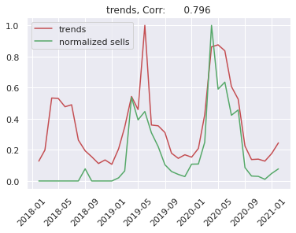
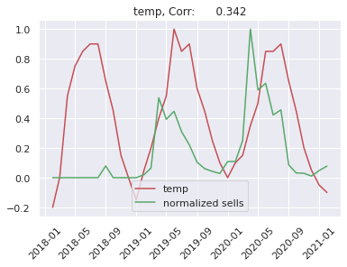
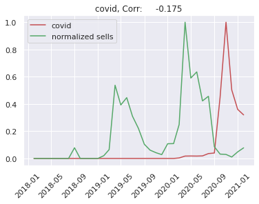
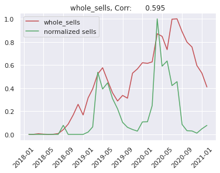
```


We can see that Shumee fastly grows. So we will predict sells of a given product devided by total number of sells in a given month. Because trend of Shumee sells depends on many things like: 
business decisions, market competition and others. This is very difficult to predict by any artificial intelligence model, so we simplify our problem. 

First problem which we met was: how to measure the model's error? This problem appears because we build separate models for each product. We decided to split timeseries to train and test sets in a following way: train set contains data from 2018-02 to 2020-11 and test set contains 2020-12 to 2021-02. We train the FB Prophet model on the train dataset and we measure error on the test dataset using mean squared error metric.

## Model Explanation

We see that we must build own tool for model explainability, because there are no existing ready-to-go XAI techniques for a prophet model. We decided to implement feature importance based on a column drop. It works in the following way: we select one column and we drop it. For the rest of attributes we add the columns to fbprophet as reggresors and we train model. After that we can compute the error on the test dataset for this model and we devide it by error of whole model, where in whole model we have all attributes added as reggresor. Then we can do this for all attributes. Using this method we get feature importance for single products.

In the next step we want to calculate feature importance for many products. We decided to take geometric mean to average importance for many products.

In the chart below we can see feature importance for the top 10 most seasonal products. If a value for the attribute is greater that 1.0 it means that adding this attribute decreases error of the model, otherwise adding attribute increases error. 

```{r, out.width="700", fig.align="center", echo=FALSE}

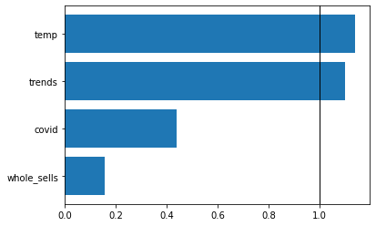
```

We can see easily that the most important attributes are temperature and google trend on the second place and they increase quality of the model. Attributes like Covid and the total number sells mostly decrease quality of the model.

Now we can compare it with feature importance for top 10 least seasonal products.

```{r, out.width="700", fig.align="center", echo=FALSE}

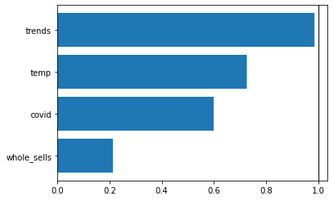
```


We can see what we would expected because temperature is not the most important factor for non seasonal products. We have google trends instead as the most informative regressor. Whole sells has very low feature importance and its value is strictly less than 1.0, meaning that it does worsen our model.

This tool can be used to select attributes which are the most seasonal. We can calculate feature importance and if on first place is temperature or any other attribute, which is connected with seasonality, we can consider this attribute as a seasonal one. 

## Data preprocessing

The first thing to note out is the dynamics of Shumee's retail growth

```{r, out.width="700", fig.align="center", echo=FALSE}

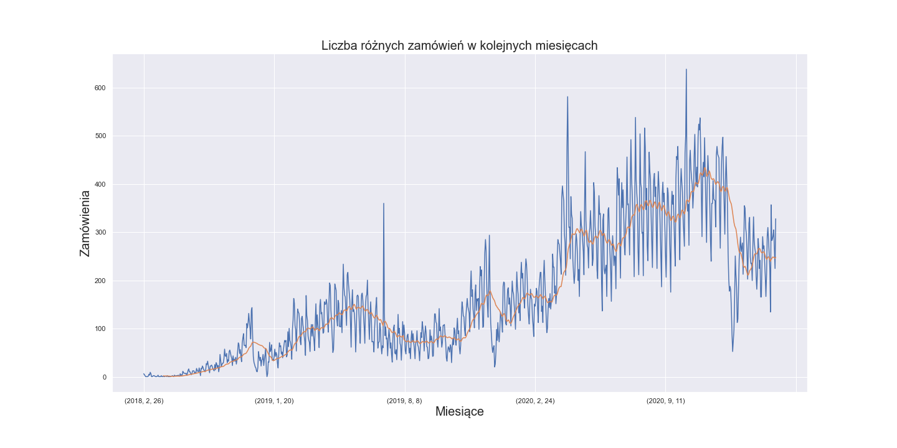
```


This rapid growth is very good news for Shumee but it means some problems for data analyst. Although we have data collected over three consecutive years, which sounds like a decent amount of data, there is in fact very little data from 2018 and 2019. This puts us in a risk of gathering noise rather than robust patterns of clients' behavior. It is possible that there is too little sells to capture true seasonality in 2019 and especially 2018 year.

What complicates things even more is that there is 41k unique products in the dataset and 160k transactions in total. This means that every product was sold only four time on average. That might be hard to find any seasonality at all! 

Let's see if there are any products which were sold significantly often:

```{r, out.width="700", fig.align="center", echo=FALSE}

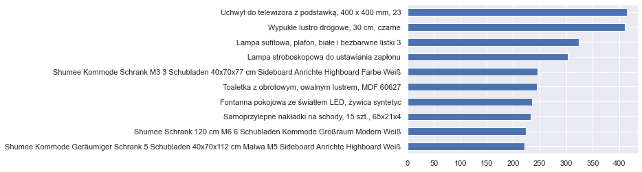
```

We can see here that the products sold the most were actually sold only 400 times - during the three years period.

So it is clear that we need to group similar products so that every such group contains enough data to perform analysis on it. But it is not that obvious how to do it because we can not rely on semantic similarity alone. Consider this example: chair and garden chair are semantically close, but in the view of our retail analysis they are completely different products: we would expect seasonality from garden chair but not from *any* chair. Another products which are semanticaly similar but actually completely different are garden fountain and chocolate fountain, because this products have same noun but different adjective. This rule does not work for green carpet and red carpet which are essentially the same products.

So what we did to overcome those problems is an amalgamation of simplifying the names, measuring their similarity based on just the letters, NLP and some dirty work of manually grouping those products.

First thing which was done was data clearing. We removed data from other domains (rynków) and we considered only data from polish domain(rynek). We removed transactions with names suggesting that they was added for testing purposes. They often contained words : "test", "ssss". In the next step we removed from products's names things like: product brands, colors, materials from which they were made, size, other insignificant informations. To group the same products we used DBSCAN clustering. The metric used for clustering was based on the levenshtein distance. Using this transformations we achieved 9k groups which we used to analize retail and seasonality.
