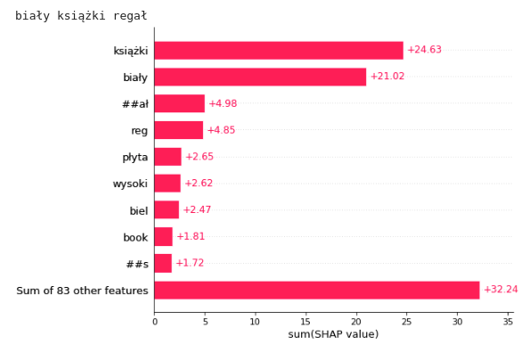

# Story: Embedding-based model for product recommendations

*Authors: Andrzej Zapała (University of Warsaw), Jakub Modrzewski (University of Warsaw), Piotr Duszak (University of Warsaw)*

*Mentors: Jakub Tyrek (McKinsey), Wyszomir Janikowski (McKinsey)*

## Introduction 

---

Global COVID-19 pandemic pushed e-commerce sector to new heights. While recurring lockdowns froze many classic businesses, online sale platforms prospered better than ever. And any e-commerce platform will, likely sooner than later, encounter the need to include a recommendation engine in its business model. Regardless of whether its interests lie in groceries, cosmetics, cars, jewellery, or any other product, the common factor will always be a necessity to convince the client to buy more, in the most approachable way possible.

Shumee, a client company of McKinsey with whom we have partnered on this project is no exception. During last 3 months we planned, designed, built, perfected and finally delivered a solution based on a state-of-the-art natural language processing and clustering algorithms, which we proudly present below.

## Model 

---

### Dataset and pre-processing

As with any machine-learning problem, the first step is to explore the data, squeeze any useful details and use them to create general plan. Although the dataset itself is confidential, we can share the challenges we have encountered along the way.

#### Size, structure and issues

From the beginning the task was not easy. The dataset we received contained only around 80 000 items, spanning over two years and split across twenty-two columns. It may seem like a lot, but for an advanced ML model 80 000 entries present a fairly limited scope of data. To make the matter worse, not all entries were usable - some needed to be discarded due to flaws and inconsistencies.

Arguably most important feature, the product name, was filled with multi-lingual (mainly Polish and Czech), raw, unprocessed descriptions. Baskets, which usually serve as a main backbone for recommendation engine contained in majority no more than two products.

With no pre-defined categorical structure, small baskets and rich, although somewhat short and noisy product descriptions a general picture of the model was clear - it should concentrate on the descriptions, create their embeddings with advanced NLP techniques and use them to recommend the most fitting item.

#### Ideas & exploration

During the initial phase of the project multiple models were considered, for embedding creation and for selection of recommendations based on the aforementioned embeddings. As a baseline we have created a naive association-rule-based model and a bag-of-words (or rather, a bag-of-product-descriptions) tree-based model which treated entire product description as a single unique value. Unsurprisingly, these models performed poorly (~0.2 % accuracy on the test dataset), yet still above random guess threshold. At that time there was also an ongoing discussion of whether we should work with the raw data and make the model learn all important caveats, or if the data should be pre-processed. We settled on testing both approaches, results of which we present in explanations section.

After the baseline models were trained and established, a more sophisticated solutions had to be considered. In this phase we went over popular NLP embedding creation tools such as TF-IDF and its variants, GLOVE, GLOVE with TF-IDF, custom LSTM-based method, BERT and others. We also had to come up with a way to group, compare and select the embeddings. After few weeks and a fair amount of experiments, we have settled on the following architecture.

#### Model overview

The general idea was as follows:

* translate features into a high-dimensional embedding space,
* reduce dimensionality,
* cluster the results,
* propose the recommendation based on a custom item-cluster distance function.

Our model utilizes a beautiful state-of-the-art multi-lingual embedding creation method, based on a pre-trained version of BERT from the sentence_transformers library, to translate product descriptions into a high-dimensional vector space. Multi-lingual aspect is particularly important, as it allowed us to skip translation and saved possible errors that would result from it. This method works well with both Polish and Czech language.

To reduce dimensionality of the forementioned vector space we used UMAP, and then clustered the results with hdbscan. It's worth mentioning that hdbscan also returned a grey area overhead - a set of items that do not belong to any cluster. In our case this overhead oscillated at around 20%. At this point we were left with 1764 different clusters, as depicted below, and a question of how to use them to create recommendations.

An attempt to create a complementary, more XAI-friendly model was made. We tried an idea revolving around collaborative cluster filtering, well described [here](https://towardsdatascience.com/collaborative-embeddings-for-lipstick-recommendations-98eccfa816bd), but ultimately gave up on this approach due to the quality of results.

Below we illustrated the timeline of our efforts.

## Explanations

---

Explanation techniques were essential for two reasons. First, we wanted to prove that clusters are properly and reasonably formed. Second, in case they were not, explanation techniques offered great degree of assistance in finding flaws and fixing them. We applied two techniques: LIME and SHAP.

### Lime

LIME requires probability scores in the output to work, so we had to come up with a method to generate them for new items. We tested two item assignment paradigms - one based on an euclidean distance between the item and central points of nearest clusters, and another based on a number of votes from the well-known KNN classifier. The latter gave better results.

Below is the first explanation, depicting why these two items belong to a particular cluster. Two words with the greatest influence are "drzwi" and "bambusowy" - which makes perfect sense. It is also worth to note that clusterization works for both Polish and Czech language, as mentioned in the model overview.

And while the majority of our explanations looked promising, we managed to find examples of badly formulated clusters. Which could be considered a flaw, since no researcher wants to see their model fail, but we believe otherwise - this exact scenario proves why we need XAI in the first place. Machine learning models may be good, outstanding even, but explanation techniques allow us to uncover aspects which are not yet perfect and achieve even higher reliability and robustness. Next illustration depicts one of these badly formulated clusters. The most impactful word here is 'XL' (refering to the size) and while one could make an argument that "this is good, people wearing XL-sized apparel would buy XL clothes", this particular cluster also contains an unrelated motorcycle cover.

Keeping these findings in mind we decided to improve our model. The obvious choice was to remove arguably redundant words like 'XL' above, and so we did - and a bit more. Entire first stage of the pipeline was reworked. We used pre-processing based on the removal of stop words, numbers and lemmatization of the remaining phrases. This resulted in a visible improvement in quality of the clusters formed. Below is an example explanation of newly created cluster, with "motor" and "motocykl" words in the spotlight, an assignment criteria much more sensible than before.

Yet, nothing in the word is perfect - even after pre-processing some of the clusters were not correctly formed. Below is one such example, where the most important word is 'czerwony', meaning red in Polish and Czech. And the argument is the same as with 'XL' word before - this particular cluster groups somewhat unrelated items based solely on color.

### Shap

#### TF-IDF cluster names

In order to gain a better overview of the clusters we decided to create a cluster naming convention and compare the results with SHAP. Tf-idf was calculated for each cluster, treating a combination of product descriptions that belonged to that cluster as a single document. We then used three most common words according to tf-idf metric to form a cluster name. Names created in such a manner did not include company names (Pepco, Shumee, Vixdal) which were fairly common in the dataset. Few examples are shown below.

#### Instance level explanations

Similarly to Lime, Shap requires probability scores in the model output. This time we skipped KNN and used an inverted euclidean/cosine distance to the closest cluster central point as a likelihood of membership. Two embedding spaces were used for tests: raw BERT (512-dimensional space), and UMAP-reduced BERT (6-dimensional space). Based on what we have learned form LIME, both of them were created from the lemmatized version of dataset. 

Performance of both metrics was closely related to the selected space. Euclidean distance performed better in a six-dimensional environment, cosine similarity in a high-dimensional Bert space. We assessed the results on basis of several dozen examples from various clusters, and while they were of lower quality than the ones obtained with LIME, they still offered a meaningful insight into the correlations and strength of a different influences within a particular cluster.

Below is a SHAP explanation of the first examples used in LIME section. The two most influential words are "drzwi"/"dveri" (meaning door) and "bambusowa"/"bambusovy" (meaning bamboo), same as in LIME, which seems reasonable - cluster name obtained with tf-idf as described above is "dveřní zasłona bambus" (losely translated as "bamboo door curtain"). These explanations were made with an euclidean metric and in a reduced space. Euclidean metric on a reduced space gave the the most valuable insights, however later on we used high-dimensional space and cosine distance to improve performance.

#### Anchor explanations

Words in previous examples rarely shown a negative impact on the overall score - usually it was positive or neutral. To counter this flaw we attempted to expanded instance level explanations. Expanded explanation works as follows - one cluster serves as an anchor, and the closest cluster to the anchor is examined. Then SHAP is fed with a distance between an instance from the cluster being inspected and a central point of the anchor. What differentiates this method from previous one is an ability to highlight words that separate closely situated clusters.

An example of this method is depicted below - we have "mango szafka nocna" (meaning mango nightstand) as a main cluster, and the anchor cluster named "lite drewno mango" (meaning solid mango wood). The words separating these two clusters are "nocny" and "ręcznie" ("night", "manual"). The word shared between the two is "mango". However, "lite drewno" can have a positive or a negative impact, depending on its position in the item description. Intuitively this phrase should always positively affect the likelihood of belonging to a cluster called "lite drewno mango", which uncovers potential flaw in this method. 

#### Cluster level explanation

A global explanation would make a little to no sense in our case - SHAP would simply return the words that are most frequent in the entire dataset. Instead we found the most influential words in each cluster and compared them to the cluster names created with tf-idf, as described earlier. We were unable to modify the masker in provided by the SHAP library to divide descriptions into words rather than sub-words, so the importance in the following examples is determined for sub-words only (the word "parawan" is divided into "para" and "##wan").

Illustrations below depict influence of selected sub-words in the clusters "biały książki regał" and "klasická klasyczną początkujących".

In first example, the cluster name corresponds to importance values from the SHAP plot. The most relevant sub-words - "książki", "biały", "##ał", "reg" - are included in the name of cluster. Highest SHAP importance values overlap here with the highest tf-idf metric.

The second example contradicts the result given by the previous one and proves that naming a cluster based on tf-idf score is not flaw-free. In this case, the words referring to the guitar ("guitars", "guitar", "kytara") are of high importance, but are not included in the cluster name. A closer inspection of the cluster contents reveals clearly that guitar should indeed be important. Cluster contains various guitar-related items. The words "klasika" and "klasyczną" have high impact according to SHAP, while the word "początkujące" does not appear at all. Based on this example we can argue that SHAP importance hierarchy can be as good a representation of the cluster as tf-idf-based names, and in selected cases even better.

## Summary and conclusions 

---

While our model is not perfect, we're fairly pleased with the result. Most of the clusters formed make sense and recommendations are reasonable. Possible vector of future improvement could cover issues with rare, yet not completely non-existant clusters that were formed incorrectly. Whether a greater degree of pre-processing, changes in the model architecture, new data or possibly other improvements could help, only a further development and tests would tell.
