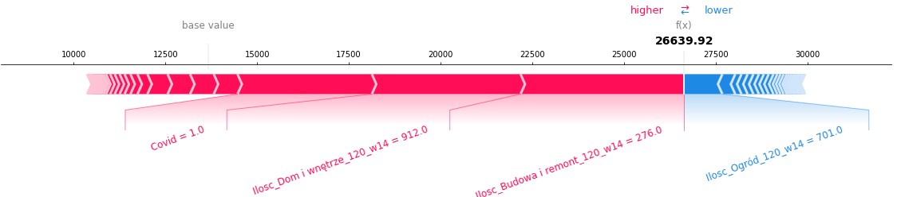

# Story Sales Prediction
Long and short term shumee company sales predictions based on historical data and product categories

*Authors: Group 4*
Mateusz Sieniawski, Michał Raszkowski, Piotr Krzywicki, Stanisław Antonowicz, Adam Sobiński

*Mentors: Group 4*
Błażej Wiórek, Miłosz Dobersztyn


## Introduction 

The use of machine learning and deep learning in business settings is rapidly evolving in recent years. In particular, e-commerce companies implement AI-based solutions to aid them in following tasks:

* Recommendation systems @zhang2019deep
* Business decision making, which might include:
	+ Lowering or increasing product prices @ferreira2016analytics
	+ Predicting general consumer demands @van2020predicting
* Fraud detection @nanduri2020microsoft
* Sales prediction @cadavid2018trends

In this project, we decided to explore the last problem: forecasting future profits based on historical sales data. We used the data provided by *shumee* (https://shumee.pl), a Polish e-commerce company mostly selling various household products online.

Additionally, all of our models are interpretable using multiple explainable machine learning techniques such as SHAP @lundberg2017unified, LIME @ribeiro2016should, PDP @friedman2001greedy, Ceteris Paribus Profiles @goldstein2014peeking, and Variable Importance @fisher2019models. 

## Data

### Overview

The data consisted of a list of around 180 thousand orders starting in February 2018 and spanning three years. This dataset proved to be challenging because the three-year time period is too short to allow learning yearly trends. Moreover, essentially the only information that was available about products was their name. Another obstacle was that *shumee* is a small, yet rapidly growing company. An obvious rising trend can be observed in the graph of sales.


<center>

{width=70%}

</center>

During the global COVID-19 pandemic (which started in Poland in March 2020), many e-commerce companies observed an increase in sales. As we can see from the graph above, this was also the case with *shumee*. Another crucial factor was that the company has been expanding and has entered new markets in European Union, two of the biggest being Czech and Slovak markets.


Because of those factors, after some preliminary experiments we decided that we won’t use time series-specific methods like ARIMA or a more recent *Prophet* @taylor2017forecasting, as they weren’t able to accurately predict even a couple of days or weeks of sales. Instead, we used traditional machine learning models suitable for learning non-linear relationships.


| Column        | Description                                                                               |
|---------------|-------------------------------------------------------------------------------------------|
| Order ID      | Cart ID – products bought together had the same order ID                                  |
| Date          | Date of order (with minute-level resolution)                                              |
| Source        | Distributor of the product                                                                |
| Country       | These columns regard the client address                                                   |
| City          |                                                                                           |
| ZIP code      |                                                                                           |
| Product name  | Product names were in multiple languages, mostly in Polish                                |
| SKU           | Stock keeping unit (https://en.wikipedia.org/wiki/Stock_keeping_unit)                     |
| EAN           | International Article Number (https://en.wikipedia.org/wiki/International_Article_Number) |
| Quantity      |                                                                                           |
| Product Price |                                                                                           |
| Currency      |                                                                                           |
| Delivery cost |                                                                                           |
| Delivery type | E.g. which courier company was delivering the product                                     |

<center>


</center>

To clean the data we removed products with missing or negative prices. We also unified the language of product descriptions to Polish using third-party translation software *deepL* (https://www.deepl.com/). Finally, the currencies of all orders were unified to euro according to the currency exchange rate in a day of a given order.

In the original data, there was no information about product categories. Initially, we wanted to retrieve it from SKU and EAN, but unfortunately, these didn’t carry any meaningful insights about the product. A large number of rows are missing these, and each distributor has its own naming conventions.

We wanted to take advantage of categories assigned to each product, therefore we scrapped around 30 thousand product categories from the *shumee* official website. The product categories turned out to be organized at three levels.

<center>


</center>

The last one was too fine-grained and sometimes contained product names, so we decided to only use the first two. For example, a first-level category *Dom i wnętrze* had two sub-categories: *Meble* and *Oświetlenie*. The distribution of the amount of first-level product categories looks as follows:

<center>


</center>

### Assigning missing categories

About 2/3 of products didn’t have categories assigned. We solved this issue with the nearest neighbors approach. We used *spaCy* @spacy library for obtaining part of speech tags and also word vectors for each word of product description. We then averaged word vectors of nouns and adjectives. The *UMAP* @2018arXivUMAP plot constructed on word vectors shows that products in each category are very diverse. But they generally form small subclusters in which the nearest neighbor query might work correctly.

<center>

{width=70%}

</center>

The resulting vectors for each known product were put in a KDTree data structure for fast nearest neighbor queries. The model achieved 90% accuracy and 81% balanced accuracy on a 10-fold cross-validation. We also prepared LIME instance-level explanations of our model.

<center>

{width=80%}
{width=80%}
{width=80%}

{width=80%}

</center>

## Long-term sales forecasting 

The long-term sales figures forecasting might have a crucial impact on the company's strategy. We prepared a machine learning model, which can forecast up to a few months of future sales. 

### Model description

<center>


</center>

We used a random forest model that predicted the daily value of sales i.e. given a day, what will be the total value of all products sold this day. The training was done on the whole dataset, except for the last two months that were used later for testing. To tune hyperparameters, we utilized the *optuna* @optuna_2019 framework, which automatically searched for the best parameters with regard to MSE score on cross-validation. For cross-validation we used TimeSeriesSplit from sklearn @scikit-learn to assure time contiguity and that the model can not use data coming from the future. The model uses as input:

* The number of products sold in each first-level category averaged over three two-week windows in the past
* Information whether we are after or before the start of the COVID-19 pandemic
* Date (year, month, day, weekday)

<center>

{width=70%}


{width=55%}

</center>


### Model explanations

#### Global explanations

<center>


</center>

It represents the 20 variables that had the greatest impact on the predictions of the model. At the top of the chart, there are variables with the largest SHAP attributions. For example, *Ilosc_Budowa i remont_120_w14* was the most important variable. Let’s break down the name of this feature: Ilosc means the number of products sold in the category *Budowa i remont 120* days ago averaged throughout the length of *14* days.


An important observation is that the three most important product categories to the model (*Budowa i remont*, *Dom i wnętrze*, *Ogród*) are also the top three first-level categories in terms of the number of orders. This suggests that the model properly recognizes the importance of each category.

We also prepared Partial Dependence Plot explanations to get insight into how a change of one feature impacts the overall predictions of the model:


<center>

{width=80%}
{width=80%}
{width=80%}


</center>

<!--

```{r, echo=FALSE, out.width="50%"}
knitr::include_graphics(c("./images/04_pdp_1.png","./images/04_pdp_2.png"))
knitr::include_graphics(c("./images/04_pdp_3.png","./images/04_pdp_4.png"))
``` 


-->


The trend is clear – as the number of products sold in a given category rises, so does the predicted value of sales. This makes sense, as more products sold in the near past influence the value of products sold today. However, after some critical value, the graph flattens out. This suggests that the model is prone to overfitting i.e. a big change of products sold in only one sub-category does not influence the total sales value drastically. 

#### Instance-level explanations 

We prepared instance-level SHAP explanations, which give insight into which features had a deciding effect on the final prediction. The graph below presents an example explanation of predicted sales for 17th January 2021. By looking at the graph, one can see that variables colored red are increasing the value of prediction, while those colored blue decrease it. In this particular example, the predicted total value of sales is much higher (26,6k €) than the base value (13,8k € – the averaged sales value in the training dataset). The factors that influenced the model prediction the most are similar to those in the global SHAP explanations. 

<center>



</center>

17th January 2021 was almost a year after the start of the COVID-19 pandemic. The red bar stands for the real value of sales, while the blue one is the hypothetical value of sales if there was no pandemic. With this plot, the final user can answer the question: “What would the total sales figures look like if the pandemic didn't happen?”.


<center>


</center>


Another type of instance-level explanation we prepared was Ceteris Paribus profiles, which can provide information on how in the case of a particular observation, the total sales value would change if the value of a given feature would change. These profiles regard the same observation as instance-level SHAP explanations presented above. In the following graphs the red dot symbolizes the real value of sales, while the blue line shows the model prediction if a given feature value changed.

<center>


</center>

We observed an interesting trend regarding the weekdays. The largest sales figures are on Mondays and are slowly decreasing throughout the week, until the lowest point, which happens on Saturdays. The model successfully captured this trend as visible in the graph above. Later on, the *shumee* representatives confirmed that this trend is in fact happening and our model properly understood it.

<center>


```{r, echo=FALSE, out.width="50%"}
knitr::include_graphics(c("./images/04_cp_ogrod.png","./images/04_cp_dom_i_wnetrze.png"))
``` 


</center>

The Ceteris Paribus profiles for categories look very similar to the PDP plots. The highly dynamic, almost discontinuous graphs are due to the fact that we used the random forest as our primary model. For example, in the case of neural networks, these graphs would look smoother.

<center>


</center>

We also observed an anomaly. In most PDP and Ceteris Paribus plots, a higher number of sold products in a category results in greater overall sales figures. However, in this profile, it is quite the opposite. This phenomenon is intriguing, yet the explanation is quite simple. If the sales figures in the recent few months were ‘flat’ then if the number of sold products 5 months ago were lower, it would suggest the existence of a rising trend, increasing the total sales prediction.

<center>


</center>

This phenomenon is intriguing, yet the explanation is quite simple. If the sales figures in the recent few months were ‘flat’ then if the number of sold product 5 months ago were lower, it would suggest the existence of a rising trend, increasing the total sales prediction.

#### Choice of model features

In this section, we explain why we have chosen the aforementioned input variables. Most of the comparisons were based on train and test metrics – mainly MAE & RMSE. But the interesting ones utilize XAI techniques, which allow us to understand how our model works and adjust the input variables accordingly.

##### Two-week windows

We wanted to know how large the rolling window over which we average sales numbers should be. Therefore, we built a model which used windows of multiple sizes: 1, 7, and 14 days. The SHAP attributions for this model looked as follows:

<center>


</center>

We can see that this model looked almost only at the two-week windows. Also, the two-week windows were always more important than the other window sizes. Additionally, this model has around 10% worse performance on the test set compared to our final model. It may suggest that adding more window sizes to the model inputs made it overfit more.

##### Using the number of sales only

<center>

```{r, echo=FALSE, out.width="50%"}
knitr::include_graphics(c("./images/04_counts_only.png","./images/04_counts_and_sales.png"))
``` 


</center>

Initially, our model was trained on both the number of products sold, as well as the total value of products sold per category. At one point, we decided to check how the performance would change if we were to train it on the number of products sold only. To our surprise, the latter performed around 50% better on the test set while maintaining similar errors on the train set. We believe that adding this additional information rendered the model prone to overfitting.

##### Before/after start of pandemic

Considering the impact of the COVID-19 pandemic on the global economy, we decided to include information about it for our model. At first, our model used the number of days before or after the start of the pandemic. However, the addition of this variable caused huge problems with overfitting, which can be seen on the global SHAP attribution graph below.

<center>


</center>

Replacing this feature with a boolean flag for whether we are before or after the pandemic helped tremendously. The model performance on the test set improved by roughly 45%.

## Short-term sales forecasting

In the previous section, we analyzed a regression problem: "What will be the total sales figures value three months from now?". In this section, we looked at this problem from a different perspective, as a classification problem. The question we try to answer here asks: "Is sales figures' total value going to be higher or lower than in the previous day?".

### Models' description

The use-case of this short-term model is significantly different from the long-term one. Now we want to predict highly dynamic changes that happen over a time span of several days. This makes it possible to, for example, quickly create appropriate coupon strategies which suit customers' preferences at a given time.

<center>

{width=75%}

</center>

Moreover, it’s viable to look at the most recent data points when making sales predictions for the next day. If we were to use our previous long-term model for such a task, we wouldn’t take into account the sales value from the last few immediate days, despite the fact that they provide much of the precious information.

To this end, we developed short-term models in which inputs are sales (volume and total price) divided into particular subcategories over the span of 5 last days. We also provide weekday, month, and year to the model inputs. For models different than decision-tree-based, we decided to use the one-hot encoding of months and weekdays. Otherwise, models such as linear regression would have been at a significant disadvantage.


To solve this short-term classification problem we trained three models: 

* adaboost gradient boosting method using sklearn 
* lasso logistic regression 
* fully connected feed forward neural network

For AdaBoost and logistic regression default parameters from sklearn worked fine, and further hyper-parameter search gave very similar results, so we stayed with default ones.

Only the neural network approach required manual extensive tuning. To make this approach work, we find out the architecture, which consists of two hidden layers of size 32, ReLU activations, dropout of 0.5, batch-normalization, optimized using the Adam optimizer. Despite all these regularization techniques, the neural network approach overfitted the most getting results subpar to AdaBoost and logistic regression.

### Results

<center>

{width=70%}

</center>

All classification models predicting whether the sales will move up or down significantly outperformed simple baselines such as returning last movement class. The AdaBoost model got the best balanced accuracy score of all models, suggesting the need to leverage input variables' interaction. The logistic regression model, which scored as the second, won't capture such interaction. The third and last was the neural network model. Generally, those models perform better on unstructured data while not as great on tabular data as the previous two.

<center>

{width=70%}

</center>

We also illustrated the models' performance using ROC (receiver operating characteristic) curves, which show false positive and true positive rates of the model for a given threshold. Again, this time comparing the AUC score (Area Under Curve), the AdaBoost model works best, followed by logistic regression, then by the neural network.

One can observe that it is possible to choose a threshold value such that the gradient boosting model has a true positive rate of 0.5 while maintaining a false positive rate of 0. In other words, when the model says the sales value will go up, with a very high probability that it will go up. That property can certainly be used for shumee’s competitive advantage.

### Models' explanations

<center>


</center>

We calculate the global permutational variable importance of input features for each model. Overall, the most important feature was the weekday. In the case of AdaBoost, it had an enormous impact on model prediction. For the other two models, it was divided into effectively six different variables via one-hot encoding. From these variables, the ones indicating Saturday, Sunday or Monday carried greater importance. This matches with an observation that the significant change in sales dynamic happens for these weekdays.

<center>

{width=80%}

</center>

Given that weekday is the most important variable, we investigate its dynamic using partial dependence profiles. We come to the conclusion that the same trend as in the long-term predictions can be observed here in the PDP of the weekday feature. The probability that the sales value will rise decreases throughout the week, having the lowest value on Saturday and the highest value on Monday.

### Why don’t we use short-term regression model instead

We used a classification model because short-term regression models' quality was mediocre and comparable to simple baselines such as returning last sales value or exponential moving average. In other words, for this particular dataset, short-term sales regression is a harder problem than short-term sales movement classification, in which we got surprisingly good results (80% balanced accuracy).

We came to this conclusion by comparing gradient boosting short-term regression model (with the same inputs as described above) to 3 simple baselines:

* Standard xgboost algorithm, with taking inputs from different number of days into account 
* Constant model, which returns mean value over test set (first two months of 2021)
* Model which returns sales value from the previous day 
* Exponential moving average of sales values with different effective window sizes

<center>

{width=80%}

</center>

The interesting fact of this comparison is the dynamic of exponential moving average wrt effective window size. Compared to xgboost model, which has seemingly non-structured dynamic wrt window-size, exponential moving average has very regular error dynamic, which decreases with window size up to 8-10 and then increases.

## Summary and conclusions

We prepared sales forecasting machine learning models based on data provided by shumee, a Polish e-commerce company. Our main focus was on long-term (up to a few months) sales figures forecast, but we also tackled the problem with a shorter prediction time span.

These models can have a major impact on the strategy of the company with serious business applications. Our main long-term predictions could help more precisely foresee the growth of *shumee*, as well as anticipate demand in the broader time horizon. The short-term model can give insights into the dynamic, day-to-day sales changes. This makes it possible to, for example, create appropriate coupon strategies which suit customers' preferences in no time.

We utilized multiple XAI techniques, which gave us insight into which variables are the most important and how they influence the predictions. Using them, we successfully debugged and improved the quality of our models. Moreover, the final user does not have to treat the models as black-boxes thanks to instance-level explanations. One can get meaningful information about how they work underneath and explain their predictions.
