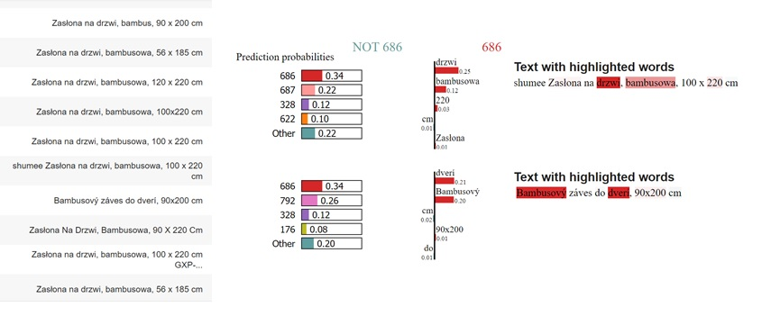

# Team 5

*Embedding-based model for product recommendations.*

*Authors: Andrzej Zapała (University of Warsaw), Jakub Modrzewski (University of Warsaw), Piotr Duszak (University of Warsaw)*

*Mentors: Jakub Tyrek (McKinsey), Wyszomir Janikowski (McKinsey)*

## Introduction 

---

Global COVID-19 pandemic pushed e-commerce sector to a new heights. While lockdowns froze many classic business models, online sale platforms prospered better than ever. And any e-commerce platform will, likely sooner than later, encounter the need for a recommendation engine of sorts. Regardless of whether its interest lie in groceries, cosmetics, cars, jewellery, or any other product, a common factor will always be the necessity to convince the client to buy more, in the most approachable way possible.

Shumee, a client of McKinsey with whom we've partnered on this project is no exception. During last 3 months we planned, designed, build, perfected and finally delivered a solution based on a state-of-the-art natural language processing and clustering algorithms, which we proudly present below.

## Model 

---

### Dataset and pre-processing

As with any machine-learning related problem, first step is to explore the data, squeeze any useful details and use them to create general plan. Although the dataset itself is confidential, we can share the challenges we've encountered along the way.

#### Size, structure and issues

From the beginning the task wasn't easy. The dataset we received contained only around 80 000 entries, spanning over 2 years and split across 22 columns. While it may seem like a lot, for an advanced ML model it's not much. To make the matter worse, not all entries were usable - some had to be discarded.

Arguably most important feature, the product name, was filled with multi-lingual (mainly Polish and Czech), raw, unprocessed descriptions. And to make the matter worse, baskets which usually serve as a main backbone for recommendation engine contained in majority 2 products at most.

With no pre-defined categorical structure, small baskets and rich, although somewhat short and noisy product descriptions a general picture of the model was clear - it should create product embeddings with advanced NLP techniques and use them to recommend the most fitting product.

#### Ideas & exploration

During the initial phase of the project multiple models were considered, both for embedding creation and for selection of recommendations based on the forementioned embeddings. As a baseline we've created a naive association-rules model and a bag-of-words (or rather, a bag-of-product-descriptions) tree-based model which treated entire product description <<?>> as a single unique. Unsurprisingly, these models performed poorly (~0.2 % accuracy on the test dataset), yet still above random guess threshold. 

---> Lemmatization

---> Experiments?

After the baseline models were trained and established, a more sophisticated solutions had to be considered. In this phase we went over popular NLP embedding creation tools such as TF-IDF and it's variants, GLOVE, GLOVE with TF-IDF, custom LSTM-based method, BERT and others. We also had to come up with a way to group, compare and select the embeddings. After few weeks of experiments we've settled on the following architecture.

#### Model overview

The general idea is as follows:

* translate features into the high-dimensional embedding space
* reduce dimensionality
* cluster the results
* propose the recommendation based on a custom item-cluster distance function

Our model utilizes a beautiful state-of-the-art pre-trained multi-lingual embedding creation method - distiluse-base-multilingual-cased-v2 from the sentence_transformers library - to translate product descriptions into the high-dimensional vector space. Multi-lingual aspect is particularly important, as it allowed us to skip translation and saved possible errors that would result from it. This method works well with both Polish and Czech language.

To reduce dimensionality of the forementioned vector space we used UMAP, and then clustered the results with hdbscan. It's worth mentioning that hdbscan some grey area overhead - a set of items that do not belong to any cluster. In our case this overhead oscillated at around 20%. At this point we were left with 1764 different clusters and a question of how to use them to create recommendations.

<< collaborative filtreing >> ?

<< Distance metric >> - TODO - explain how is the cluster selected

## Explanations

---

We used explanations for two reasons. First to proof our clasterization has sense and also possibly to find some bugs and improve it. We applied two techniques: LIME and SHAP.

### Lime

Because LIME needs probabilities we had to invent some method to generate probablities for new items. We tested two: euclidean distances from middles of clusters and votes in KNN classifier. The latter gave better results.

### Shap

TODO

## Summary and conclusions 

---

TODO
