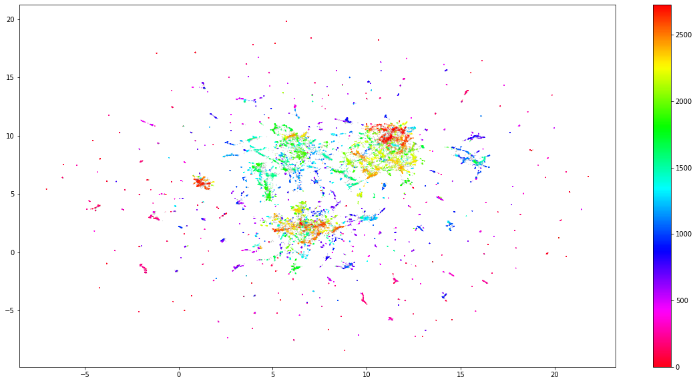
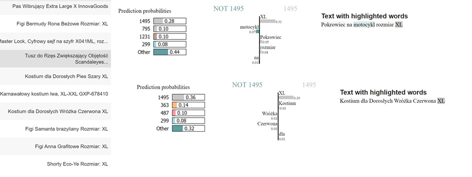
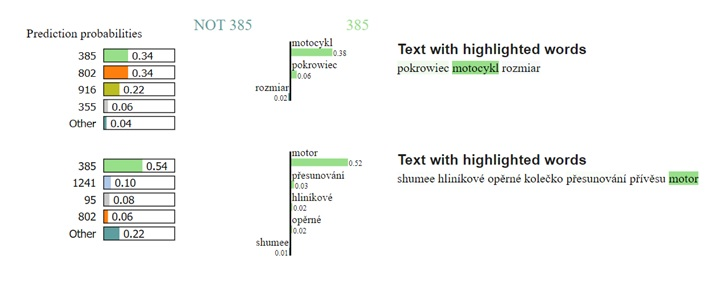

# Team 5

**Embedding-based model for product recommendations.**

*Authors: Andrzej Zapała (University of Warsaw), Jakub Modrzewski (University of Warsaw), Piotr Duszak (University of Warsaw)*

*Mentors: Jakub Tyrek (McKinsey), Wyszomir Janikowski (McKinsey)*

## Introduction 

---

Global COVID-19 pandemic pushed e-commerce sector to a new height. While lockdowns froze many classic business models, online sale platforms prospered better than ever. And any e-commerce platform will, likely sooner than later, encounter the need to include a recommendation engine in its business model. Regardless of whether its interests lie in groceries, cosmetics, cars, jewellery, or any other product, the common factor will always be a necessity to convince the client to buy more, in the most approachable way possible.

Shumee, a client company of McKinsey with whom we have partnered on this project is no exception. During last 3 months we planned, designed, built, perfected and finally delivered a solution based on a state-of-the-art natural language processing and clustering algorithms, which we proudly present below.

## Model 

---

### Dataset and pre-processing

As with any machine-learning problem, the first step is to explore the data, squeeze any useful details and use them to create general plan. Although the dataset itself is confidential, we can share the challenges we have encountered along the way.

#### Size, structure and issues

From the beginning the task was not easy. The dataset we received contained only around 80 000 entries, spanning over two years, and split across twenty-two columns. It may seem like a lot, but for an advanced ML model 80 000 entries present a fairly limited scope of data. To make the matter worse, not all entries were usable - some had to be discarded due to various flaws.

Arguably most important feature, the product name, was filled with multi-lingual (mainly Polish and Czech), raw, unprocessed descriptions. Baskets, which usually serve as a main backbone for recommendation engine contained in majority two products at most.

With no pre-defined categorical structure, small baskets and rich, although somewhat short and noisy product descriptions a general picture of the model was clear - it should concentrate on product descriptions, create embeddings with advanced NLP techniques and use them to recommend the most fitting item.

#### Ideas & exploration

During the initial phase of the project multiple models were considered, both for embedding creation and for selection of recommendations based on the aforementioned embeddings. As a baseline we have created a naive association-rule-based model and a bag-of-words (or rather, a bag-of-product-descriptions) tree-based model which treated entire product description as a single unique value. Unsurprisingly, these models performed poorly (~0.2 % accuracy on the test dataset), yet still above random guess threshold. At that time there was also an ongoing discussion of whether we should work with the raw data and make the model learn all the important caveats, or if the data should be pre-processed. In the end we tested both approaches, results of which we present in explanations section.

After the baseline models were trained and established, a more sophisticated solutions had to be considered. In this phase we went over popular NLP embedding creation tools such as TF-IDF and its variants, GLOVE, GLOVE with TF-IDF, custom LSTM-based method, BERT and others. We also had to come up with a way to group, compare and select the embeddings. After few weeks of experiments, we have settled on the following architecture.

#### Model overview

The general idea was as follows:

* translate features into a high-dimensional embedding space,
* reduce dimensionality,
* cluster the results,
* propose the recommendation based on a custom item-cluster distance function.

Our model utilizes a beautiful state-of-the-art pre-trained multi-lingual embedding creation method - distiluse-base-multilingual-cased-v2 from the sentence_transformers library - to translate product descriptions into the high-dimensional vector space. Multi-lingual aspect is particularly important, as it allowed us to skip translation and saved possible errors that would result from it. This method works well with both Polish and Czech language.

To reduce dimensionality of the forementioned vector space we used UMAP, and then clustered the results with hdbscan. It's worth mentioning that hdbscan also returned a grey area overhead - a set of items that do not belong to any cluster. In our case this overhead oscillated at around 20%. At this point we were left with 1764 different clusters, as depicted below, and a question of how to use them to create recommendations.

At this point an attempt to create complementary, more XAI-friendly model was made. We tried an idea revolving around collaborative cluster filtering, well described in [here](https://towardsdatascience.com/collaborative-embeddings-for-lipstick-recommendations-98eccfa816bd), but ultimately gave up on this approach due to the technical issues and quality of results.

For the final stage of the pipeline a method of assignment to the cluster had to be chosen - we tried two, which we describe in the next section. Below we included illustration of the timeline of our efforts.

## Explanations

---

Explanation techniques were essential for two reasons. First, we wanted to prove that clusters are properly and reasonably formed. Second, in case they were not, explanation techniques offered great degree of assistance in finding flaws and fixing them. We applied two techniques: LIME and SHAP.

### Lime

LIME requires probability scores in the output to work, so we had to come up with a method to generate them for new items. We tested two item assignment paradigms - one based on an euclidean distance between the item and central points of nearest clusters, and another based on a number of votes from the well-known KNN classifier. The latter gave better results.

Below is the first explanation, depicting why these two items belong to a particular cluster. Two words with the greatest influence are "drzwi" and "bambusowy" - which makes perfect sense. It is also worth to note that clusterization works for both Polish and Czech language, as mentioned in the model overview.

And while the majority of our explanations looked promising, we managed to find examples of badly formulated clusters. Which could be considered a flaw, since no researcher wants to see their model fail, but we believe otherwise - this exact scenario proves why we need XAI in the first place. Machine learning models may be good, outstanding even, but explanation techniques allow us to uncover aspects which are not yet perfect and achieve even higher reliability and robustness. Next illustration depicts one of these badly formulated clusters. The most impactful word here is 'XL' (refering to the size) and while one could attempt to make an argument that "this is good, people wearing XL-sized apparel would buy XL clothes", this particular cluster also contains an unrelated motorcycle cover.

Keeping these findings in mind we decided to improve our model. The obvious choice was to remove arguably redundant words like 'XL' above, and so we did - and a bit more. Entire first stage of the pipeline was reworked. We used pre-processing based on the removal of stop words, numbers and lemmatization of the remaining phrases. This resulted in a visible improvement in quality of the clusters formed. Below is an example explanation of newly created cluster, with "motor" and "motocykl" words in the spotlight, an assignment criteria much more sensible than before.

Yet, the nothing in the word is perfect - even after aforementioned fixes few of the clusters were not correctly formed. Below is one of such examples, where the most important word is 'czerwony', meaning red in Polish and Czech. And the argument is the same as with 'XL' word before - this particular cluster groups somewhat unrelated items based solely on color.

### Shap

TODO

## Summary and conclusions 

---

While our model is not perfect, we're fairly pleased with the result. Most of the clusters formed make sense and recommendations are reasonable. Possible vector of future improvement could cover issues with rare, yet not completely non-existant clusters that were formed incorrectly. Whether a greater degree of pre-processing, changes in the model architecture, new data or possibly other improvements would help, only a further development and tests would tell.
