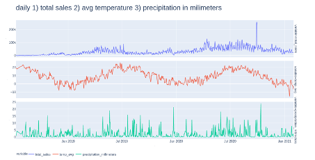
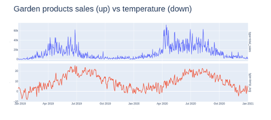
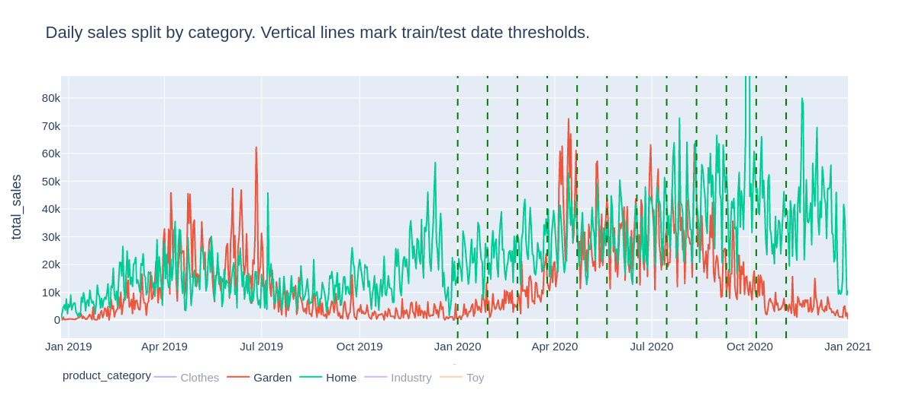
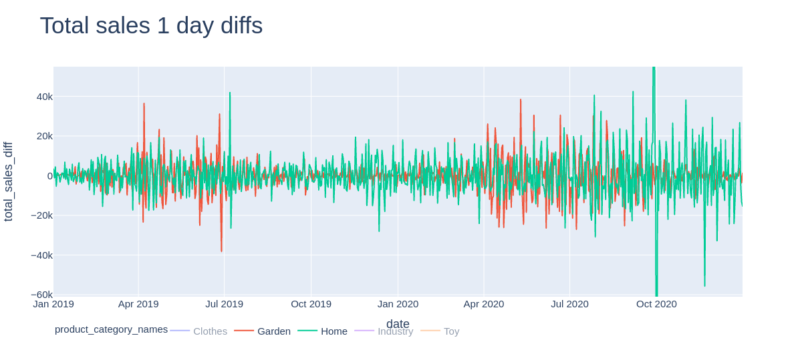
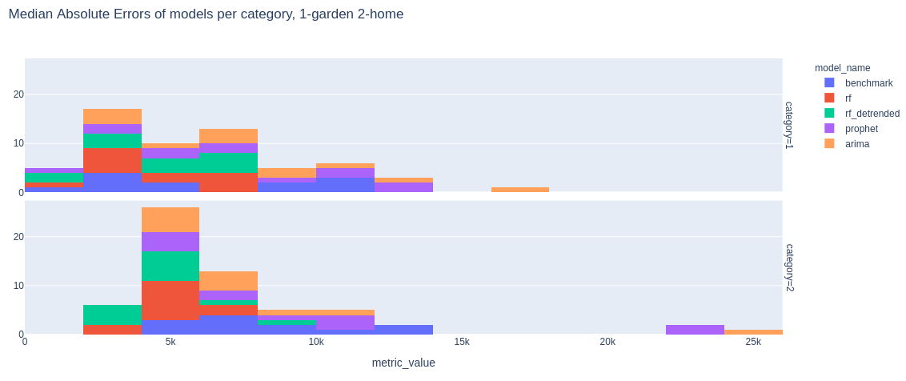
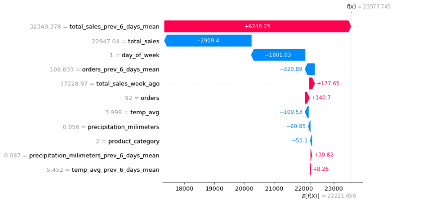
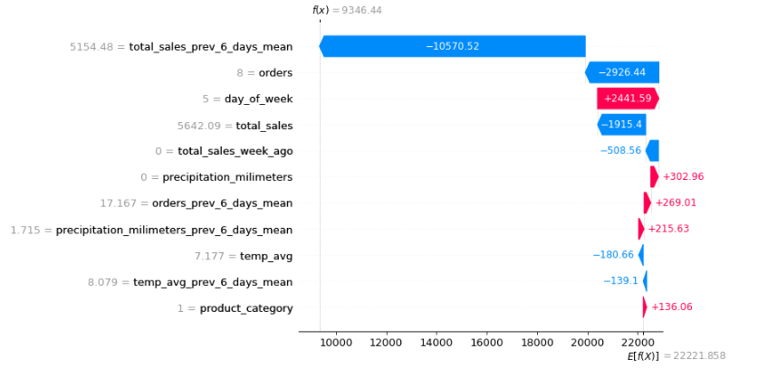
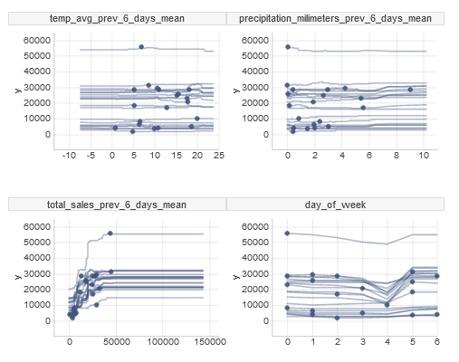
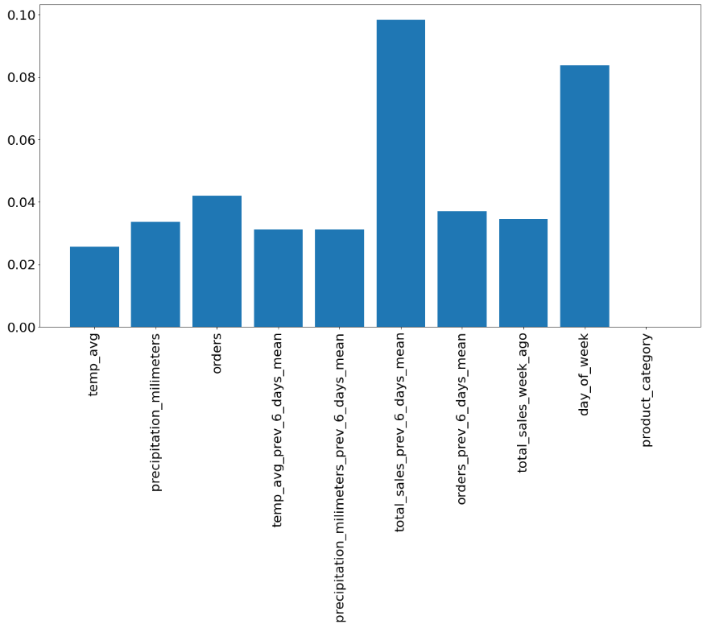
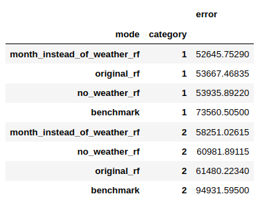

# Temperature vs sales prediction

*Authors: Olaf Placha (University of Warsaw), Tomasz Kanas (University of Warsaw), Maciej Twardowski (University of Warsaw), Wiktoria Zapart (University of Łódź)*

*Mentors: Alicja Jośko (McKinsey),  Maciej Andrzejak (McKinsey)*


## Introduction 
A constantly asked question is “How to improve sales?”. There are many factors which have an impact on sales. One of them could be weather, which is why in this part we are going to analyse if weather have an actual impact on sales. Thanks to cooperation with Shumme S.A, orders on products of the company were provided as the dataset for this project. In particular, information such as date of the order (all orders were made between 2018 and 2021), country, zip code, product name, volume and price were further used to category selection and model construction. Additionally, dataset was extended by weather information and category of the products. Weather information such as daily average temperature and total daily precipitation were retrieved from the institute of meteorology and water management database. Using first digits of zip code information we divided our data into 10 regions which we matched with accumulated weather data we obtained. In the process of category selection we choose two categories which will be further analyzed and used in model. First group covers products which we can classify as garden product (mostly furniture and accessories), second group covers products which we can classify as home category (also furniture and accessories). We also filtered only these orders which were placed in Poland. Below is an overview of total sales (without splitting into categories), average temperature and precipitation.

```{r, out.width="800", fig.align="center", echo=FALSE, fig.cap='Daily total sales, average temperature, precipitation in millimeters'}

```
An overview of garden products sales and temperature: 

```{r, out.width="800", fig.align="center", echo=FALSE, fig.cap='Daily garden products sales vs average temperature'}

```

Beside the description of the data and specification of the problem of this paper, following subjects will be covered: 

- model construction
- categories selection
- model exploration 
- instance-level exploration
- summary.

## Model 

### Product Categories

One of the first problems we faced was the categorization of products. We did not want to model sales of each product separately, but instead wanted to focus on a smaller amount of distinctively different categories. Below was explained the process that led to choosing 2 product categories of which sales were finally modelled: Garden and Home.  

Our initial approach was to automatically categorize products using polish word2vec embeddings and run K-Means clustering algorithm on vectorized product names. This proved to be problematic: Setting small number of clusters (between 5 and 15) resulted in seemingly unrelated products clumped in the same clusters. On the other hand, setting larger number of clusters resulted in too small number of products in each of them. Time series of total sales of such small 'categories' had low values and seemed to contain a lot of noise. Also, inspecting the quality of clusters required a lot of manual work.

This leads to a simpler approach that was actually used: simple categorization of products based on their names containing manually selected keywords. There were 5 predetermined categories: Garden, Home, Clothes, Toy, Industry. If a product name contained a keyword (for example "taras" i.e. terrace in Polish) specific to one of these categories, it was enough to assign category label to it (in this case Garden). In total, there were 187 keywords used, which allowed to categorize 25.000 out of 40.000 product names, responsible for more than 70% of global sales. Moreover, Garden and Home turned out to be responsible for more than 50% of global sales. Since in this project we were interested in the relationship between weather and product sales, they seemed like a great fit. Sales of Garden category products had a distinctive yearly seasonal pattern, unlike Home products. 

```{r, out.width="700", fig.align="center", echo=FALSE, fig.cap='Total sales of Garden and Home products'}

```

### Training and testing procedure

Each model was trained and tested on 12 different train and test datasets. Each training dataset contained data ranging from January 1 2019 to THRESHOLD_DATE. It was then tested on each of 21 next days from THRESHOLD_DATE. These "threshold" dates are marked above on Figure 5.1. They uniformly covered year 2020. This way of splitting train and test datasets ought to mimic a real-world scenario in which predictive models are retrained periodically and gives a more representative view into models' performance over the whole year than a single division of data into train, test (and possibly validation) sets. There were some records from the end of 2018 year, but they were discarded due to very small and unstable sales volume values.

As a validation metric we had chosen Median Absolute Error and later on looked at error distributions for 12 train/test datasets and particular models. Median version of this metric was chosen over the "Mean" one due to occasional anomalous sales values occurring the data which could distort the results. 

One of the main benefits of used metric is its simplicity and interpretability. It's drawback is that it needs some reference to assess whether obtained values are "good" or "bad"; this reference was provided by evaluating a benchmark model that always predicts no change in daily sales volume. 


### Evaluated models


#### Benchmark

To obtain some reference to models' quality metrics, a simple benchmark model was used. This model "predicts" the same daily sales volume as was observed in the current day.

#### Arima & FB prophet models

Further, pure time series models were considered, meaning the ones that only used the information of historical daily sales volumes for each of selected categories. These were ARIMA (autoregressive integrated moving average) model and a Generalized Linear Models from FB Prohpet library which incorporates trend, seasonal components and prediction uncertainty.

#### Random Forest

Finally, we incorporated a model that actually used weather information while predicting next day daily sales volume. This was a Random Forest model, that turned out to be the most effective. It used features such as:

- product category (garden / home)
- daily sales volume - today and mean over previous six days
- temperature - today and mean over previous six days
- precipitation - today and mean over previous six days
- day of week
- month
- region (unused in the final model)

Two versions of Random Forest models were evaluated. The first one predicted absolute volume of next day sales and the second one predicted the difference of daily sales volume with respect to the current day. Differencing daily sales volume (as in the second version of the model) removed the trend from the time series; this can be seen below on Figure 5.2   


```{r, out.width="800", fig.align="center", echo=FALSE, fig.cap='Differencing daily sales volumes detrends the time series.'}

```

#### Models' effectiveness

The Random Forest models incorporating among others weather information were found to be the most effective. Their Absolute Median Errors were frequently 30-40% lower compared to the benchmark model. Simpler models that used only historical sales volume data were not as good, but still significantly better than the benchmark.

The average Median Absolute Errors (in PLNs) for each model and category are presented below:

- Detrended Random Forest: ~4300 (Garden), ~4800 (Home)
- Random Forest: ~4500 (Garden), ~5000 (Home)
- Arima & FB prophet: ~5200 (Garden), ~6500 (Home)
- Benchmark: ~6000 (Garden), ~8000 (Home)


```{r, out.width="800", fig.align="center", echo=FALSE, fig.cap='Distribution of Median Absolute Errors for Garden (up) and Home (down) sales prediction'}

```

## Explanations

Explaining models’ decisions can give valuable insights into what determines the predicted value. Our explanations focused on weather importance. We divided the explanations into instance-level explanations and model-level explanations.

### Instance-level explanations

```{r, out.width="800", fig.align="center", echo=FALSE, fig.cap='SHAP values from one prediction - garden accessories'}

```

Above you can see SHAP values of one of the predictions. It is not surprising that the most influential feature was the mean sales from the previous 6 days. In this case it was substantially above the average. Moreover, moderate total sales from the previous day had a negative impact on the next day’s sales. What is also not very surprising is the fact that the day of the week, which is in this case Tuesday, also reduces expected sales. It aligns with Shumee representatives’ observations, as they usually expect enhanced sales during weekends.

Most importantly, the precipitation and the temperature had a negligible impact on the prediction. But maybe it is because the values were around the average? We definitely need more explanations to answer this question.

```{r, out.width="800", fig.align="center", echo=FALSE, fig.cap='SHAP values from one prediction - home accessories'}

```

Now you can see another prediction. Contribution of the features to the prediction is similar. Likewise, the weather didn’t impact the predictions substantially. But still, we can not be sure if weather has no impact on most predictions. There were just two examples. 

Let’s see how the predictions would change if we tweaked the weather values. To accomplish that we will use Ceteris Paribus Profiles.

```{r, out.width="800", fig.align="center", echo=FALSE, fig.cap='Ceteris Paribus Profiles of a few features'}

```

On average, temperature and precipitation prediction is stable as we change the weather values. It lets us be more confident that the weather is not very important in the model’s predictions.


### Model-level explanations

To have even more holistic understanding of the weather importance we decided to do model-level explanations. Firstly, we calculated features’ permutational importance. It relied on fixing all features except for one and permuting the not fixed feature’s values. Average absolute percentage difference between the original prediction and the prediction after permutation indicated how important a specific feature is in the predictions.

```{r, out.width="800", fig.align="center", echo=FALSE, fig.cap='Permutational importance of features in case of home accessories'}

```

Above you can see the permutational features importance in case of home accessories. The results are quite consistent with what we have obtained previously - average sales from the last 6 days as well as the day of the week are the most influential.

Finally, we decided to build 3 models with different datasets. They were:
- the original dataset 
- the original dataset without weather features
- the original dataset without weather features, with the month number

It turned out that all models performed better than the benchmark, but there were slight performance differences between the models. Namely, the model trained without the weather data, but with the month number, achieved the best score in both home and garden categories. It lets us assume that the weather is just a proxy for the season of the year.

```{r, out.width="800", fig.align="center", echo=FALSE, fig.cap='Models error when trained with different datasets'}

```

## Summary and conclusions 
Ability to predict future sales is vital to any retail business. One can use black box machine learning model to compute such predictions, but knowledge what factors contribute to future sales may be even more insightful. 

Our task was to assess the impact of temperature on sales prediction. To achieve it, we firstly trained several machine learning models predicting future sales. Then we used few XML techniques to examine effect of weather on our predictions.

Our experiments show little impact of weather on sales predictions. Both variable importance, and local explanation techniques showed some, although small, impact of weather, but model that used month number, instead of temperature and precipitation, achieved similar (even slightly better) results. It suggests, that the impact of weather in our models is mostly caused by a correlation between temperature and month.

There are few possible reasons of such outcome. Firstly, we observe substantial impact of seasonality on sales. Temperature may have impact on this seasonality pattern. For example in one year summer increase in sales may come earlier than in other year, due to higher temperatures. Unfortunately, we had only 2 years of data, which is too short to be able to observe such pattern.

Another possibility is that our model is not good enough to capture the impact of weather. There are many factors that affect sales, like seasonality, day of week or growth of the company. There was also outbreak of COVID-19 pandemic in the middle of examined period, which could affect shopping habits and made it harder to train good model. 
